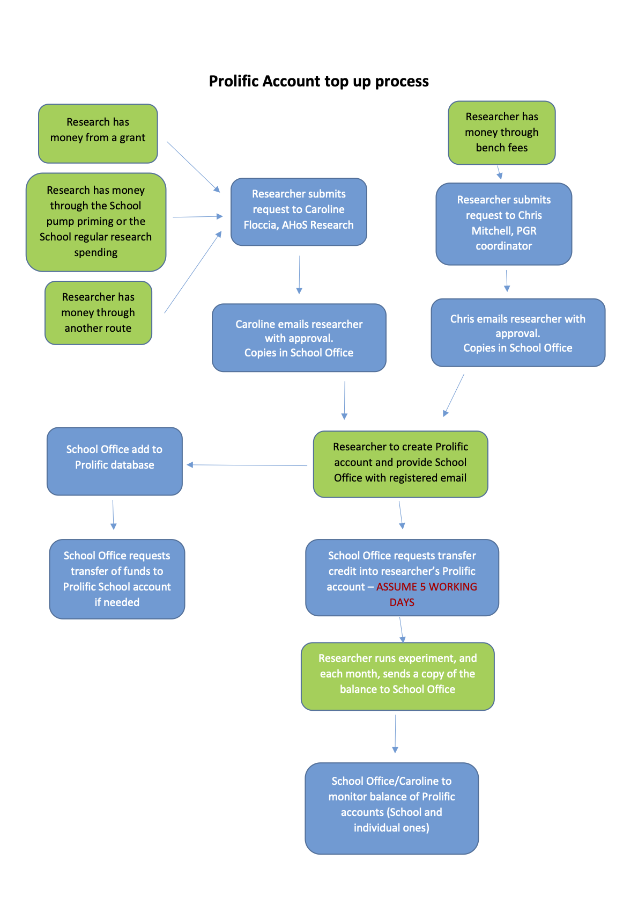

# Recruiting through Prolific
## I am new to Prolific.. How does it work? 
Prolific have created a [series of tutorials there:] (https://researcher-help.prolific.co/hc/en-gb/categories/360002553779-Getting-started) 
## What kind of experiment can I run with Prolific? 
It does easily integrate Qualtrics, SurveyMonkey, Gorilla, Typeform, or any other software using just a link. 
## Will I need an account on Prolific then? 
Yes, you will need to open a personal account (see below) and we will top it up from the ‘mother’ School account.  
## How much does Prolific cost? 
On Prolific, they endorse the principle of 'ethical rewards'. That is, they stipulate that researchers compensate participants with at least £5.00 (British Pounds) / $6.50 (US Dollars) per hour. 
To find out exactly what your study costs, please login, go to step 1 in your dashboard, and enter (1) how many participants you want to recruit and (2) how much you want to pay each participant. The system will give you a quote based on these parameters which includes our commission/service charge and any VAT if applicable.  
Please bear in mind that if your participants are in the UK, it would be only fair to pay them what we currently pay local participants through cash (pre-Covid) or with Amazon vouchers, that is, £5 per half hour.  
## What happens if I run out of funding on my Prolific account? 
It is your responsibility to check beforehand if you will have enough money to pay for your study, by doing what is described just above. Don’t forget that Prolific takes a percentage on the study, so you will end up paying more than, say, £5 per half hour.  
## Why do I have to send a copy of my balance each month to the School Office? 
Because we need to demonstrate that we know how the money has been spent. It is like keeping a record of participants’ signature on a piece of paper in the olden days.  
## Got it.. How do I get money on Prolific then? 
Follow the chart! But you need first to [sign up on Prolific ](https://app.prolific.co/register/researcher) as a researcher, preferably using your Uni credentials. 

