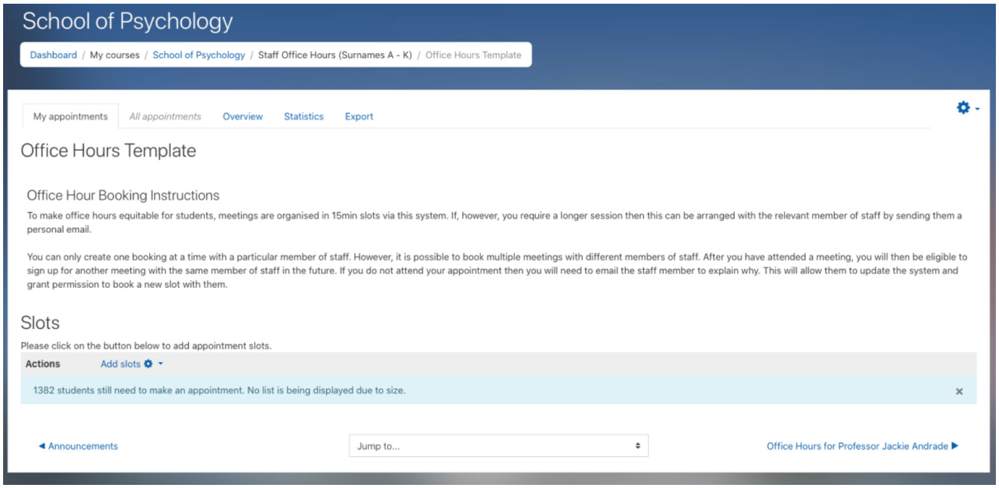
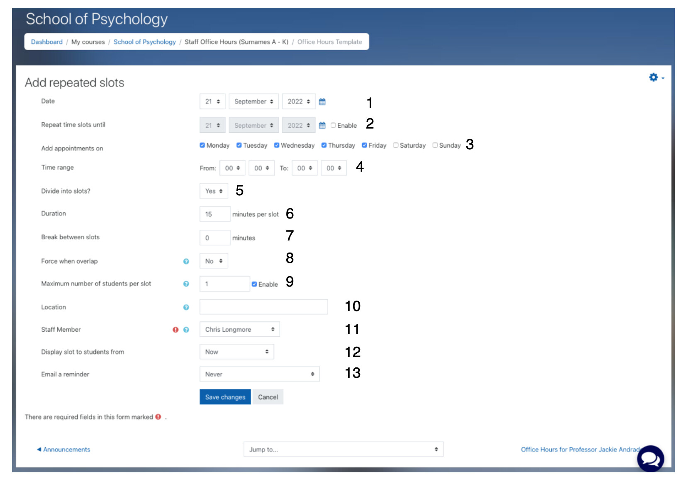

# Office Hours

## What are office hours?

All academic staff should schedule 2 hours each week for students to visit with questions or to get help with academic aspects of the course.

## Where do students book office hours?

The scheduler tool on the DLE is used for this. All staff have a scheduler created for them and it can be found here:

<https://dle.plymouth.ac.uk/course/view.php?id=66067#section-2>

## Creating Office Hour Slots in the DLE using Moodle's Scheduler

By default, with no slots created, and clicking on your scheduler will show you this page:

The text in the booking instructions is standard text inserted into every scheduler. You modify this text by clicking on the gear icon in the top right corner and selecting edit settings.

You will also see that a very large number of students ‘still need to make an appointment’. Ignore this. Clicking on the cross to the right of this message will dismiss it, but it will reappear next time you access the scheduler.

To add slots, click on ‘Add Slots’ and then select ‘Add repeated slots’ to create multiple sessions. The follow options will appear.

Use the key below to fill out this form.

1.  Select the date that you want slots to be created from. The date set here will be included in slot creation, depending upon the setting of 3.

2.  Click ‘Enable’ and select the last date that slots can be created on. The date set here will be included in slot creation, depending upon the setting of 3.

3.  Days of the week to create slots. Select the days that you want slots created on. Note that whilst the dates set in 1 and 2 might cover several weeks or months, slots will only be created on the days of the week you specify here.

4.  Set the time that the slot should begin and end. Don’t forget this is in 24-hour format.

5.  Leave on the default of ‘Yes’.

6.  Leave on the duration of 15 minutes.

7.  Leave on the default of 0 minutes.

8.  Leave on the default of ‘No’.

9.  Make sure that ‘Enable’ is checked and that the value is set to 1. 10. Type in the location of the meeting (e.g. PSQ B205). 11. Select your name from the drop down list of staff members. It should default to your own name.

10. Leave this on the default of ‘Now’.

11. Recommended to change this to ‘On the morning of the appointment’. This will cause the DLE to automatically email the student with a reminder of their meeting with you on the morning of the appointment.

Create the slots by clicking on ‘Save changes’. You will be taken back to the list of slots in your scheduler showing the newly create slots.

## Worked example

You want to create slots for the whole of the first term (12 weeks starting 26th October 2022). Slots should be created for 1 – 2pm on a Monday and 3 – 4pm on a Thursday.

Set 1 to 26 October 2022.

Click enable in 2 and set 2 to 16 December 2022.

In 3, select only Monday.

Set 4 to read: 13 00 and 14 00.

5 – 9 should be on their defaults. Check that they are.

Enter your meeting location in 10 and select your name from 11. Change 13 to ‘On the morning of the appointment’.

Click ‘Save changes’.

This will create the slots for Mondays between 26th October 2022 and Friday 16th December. Now repeat the process for the Thursday slots. Every setting will need to be the same other than 3 and 4 – change these as appropriate and click ‘Save changes’.
