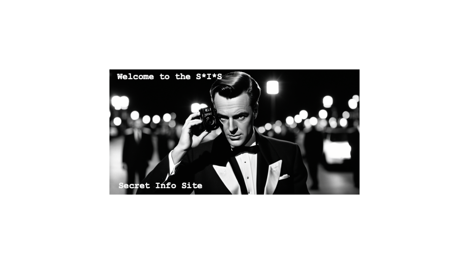

[School](https://dle.plymouth.ac.uk/course/view.php?id=66067) - [Programme](https://dle.plymouth.ac.uk/course/view.php?id=38727) - [Gradbook](https://gradbook.plymouth.ac.uk/) - [RoomBooking](https://resourcebooker.plymouth.ac.uk/) - [Timetable](https://timetables.plymouth.ac.uk/) - [Panopto](https://plymouth.cloud.panopto.eu/) - 
[TechOffice](https://psy.plymouth.ac.uk) - 
[Primo](https://primo.plymouth.ac.uk) - 
[SONA](https://uopsop.sona-systems.com/)  This site preserves the former School Information Site, codesigned with new staff to provide a single source of information about the School of Psychology at the University of Plymouth.
